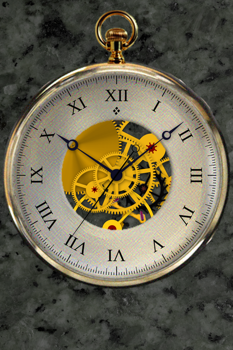
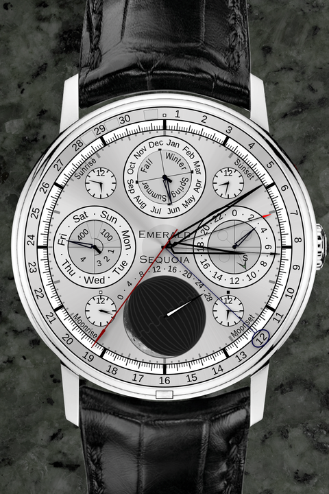
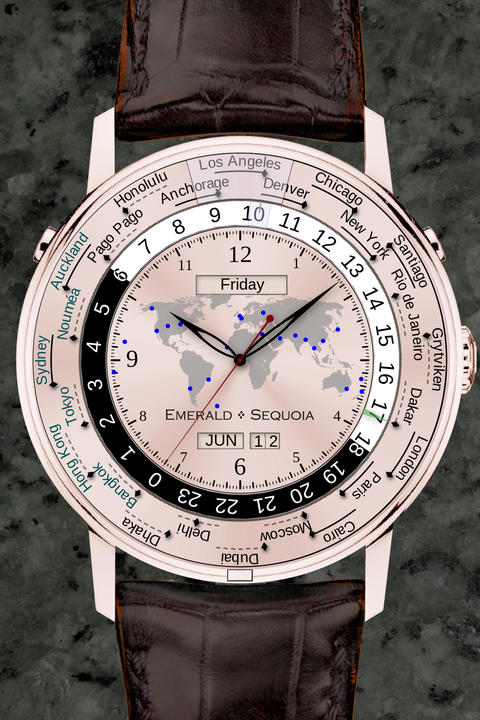
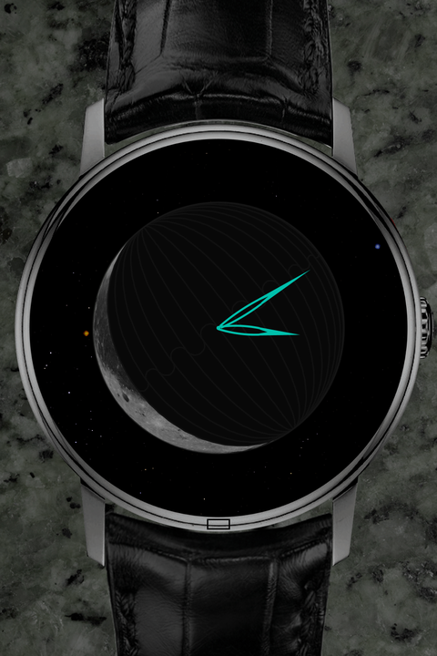
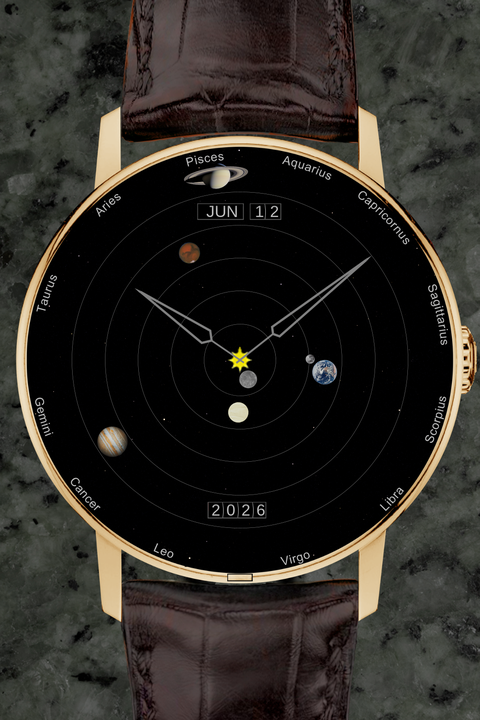
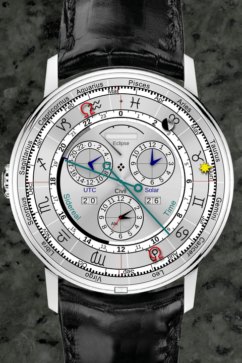

# Beryl Chronometer

A native Android port of [Emerald Chronometer](https://github.com/EmeraldSequoia/Chronometer),
the iPhone collection of mechanical and astronomical watch faces by Emerald Sequoia LLC, which
was released as open source under the MIT license. Beryl is an independent project and is not
affiliated with or endorsed by Emerald Sequoia.

The goal is the original app's native feel rather than a web wrapper: hands that sweep at the
display's refresh rate, faces that flip and slide like the iPhone's, and the same crown, pushers,
alarms, chronograph and hand-dragging interactions, all rendered from the original face
definitions and artwork.

| Tombstone | Geneva | Terra |
|:---:|:---:|:---:|
|  |  |  |
| **Chandra, night** | **Firenze** | **Geneva, back** |
|  |  |  |

*Rendered by the engine's test harness at the iPhone's 320×480 layout, which is exactly what
the app draws on a phone.*

## What is in the box

All 25 approved faces, each with its front, night and back side:

| Face | What it is |
|------|-----------|
| Alexandria | Earth-globe world clock |
| Atlantis | perpetual calendar with latitude/longitude position |
| AtlantisIV | all-digital GPS watch (no hands, every readout is a wheel behind a window) |
| Babylon | perpetual grid calendar |
| Chandra, ChandraII | moon watches with a live terminator |
| Firenze | orrery (heliocentric and horizon compass views) |
| Geneva | dress watch with calendar, eclipse display and sidereal back |
| Haleakala | sun/moon compass |
| Hernandez | sun/moon altitude and azimuth on a log-scale gauge |
| Istanbul | target-time alarm |
| Kyoto | wadokei (Japanese variable-hour clock) |
| London | pocket watch |
| Mauna Kea | astronomical 24-hour sky |
| McAlester | image-based pocket watch with open-case back |
| Miami | planetary watch (seven day/night rings) |
| Milano | retrograde calendar |
| Neuchatel | Breguet dress watch with power reserve |
| Olympia | chronograph with rattrapante |
| Paris | Bauhaus two-hand minimalist |
| Terra | 24-city world time |
| Thebes | alarm and countdown timer |
| Tombstone | skeleton movement with a live escapement, gears and balance wheel |
| Uraniborg | sidereal time |
| Vienna | clean 24-hour |

Beyond the faces: swipe between faces with the iPhone's slide animation, a live thumbnail
picker, a 3-D flip to the back, night mode, the original per-face help pages, location-aware
astronomy from the device's location, alarms that fire from background faces and ride the
face strip to the alarming watch, and per-face persistence of time warp, alarm and chronograph
state across launches.

## How it works

The faces are **data**, not code. Each is an XML definition plus image assets, and those are
reused verbatim. What was ported is the engine that interprets them:

- a C-like **expression language** the faces are written in (every hand angle, wheel position
  and button action is an expression over time and astronomy "leaf" functions);
- the **astronomy**: Willmann-Bell planetary series, the Chapront lunar series, the iterative
  rise/set solver, eclipse classification, sidereal time, Delta-T;
- the **renderer**: dials, hands of a dozen kinds, wheels, wedges, windows that cut holes in
  the layers beneath them, day/night rings, moon terminators, calendars, gears, shadows;
- the **update model**: per-part update intervals on the watch's beat grid, sweeping and
  snapping hand animations, repeat-while-held buttons.

The engine is a pure Kotlin/JVM library with no Android dependency, so it compiles and tests
with only a JDK. A thin Android module supplies the `Canvas` drawing adapter, the render
thread, gestures, location, persistence and audio. Rendering uses the same architecture as the
iOS original: static content is baked once per face and mode, hands are rasterized once and
blitted as rotated sprites, and only the dynamic parts are evaluated per frame.

The port started from the MIT-licensed
[chronometer-web](https://github.com/EmeraldSequoia/chronometer-web) TypeScript port, which
also provides golden test values, and was then audited part by part against the original
Objective-C++ source. Where the two differ, the iOS code wins. The full design, the
verification approach and every workaround are in [ARCHITECTURE.md](ARCHITECTURE.md); the
chronological story is in [DEVLOG.md](DEVLOG.md).

## Installing

Beryl is distributed as an APK on the
[Releases](https://github.com/plasticsmoke/beryl-chronometer/releases) page. It needs
Android 10 or newer. It is not on the Play Store.

**Recommended: Obtainium.** [Obtainium](https://github.com/ImranR98/Obtainium) installs apps
straight from their GitHub releases and notifies you when a new version is out.

1. Install Obtainium (from its own releases page or from F-Droid).
2. In Obtainium tap **Add App** and paste this repository's URL:
   `https://github.com/plasticsmoke/beryl-chronometer`
3. Tap **Add**. Obtainium finds the latest release, downloads the APK and hands it to Android's
   installer. The first time, Android asks you to allow installs from Obtainium.
4. From then on, new releases appear in Obtainium's update list and install over the existing
   app, keeping your face settings, alarms and time-warp state.

**Manual install.** Download `beryl-chronometer-<version>.apk` from the latest release, open
it on the phone, and allow the install when the browser or file manager asks. Later versions
install over earlier ones the same way, as long as you download from this repository: every
release is signed with the same key, and Android only accepts an update signed with the key of
the installed app.

**Permissions.** Location is optional. With it granted, the astronomical faces use your position
for sunrise, moonrise, the sky views and the world-time ring. Without it they use San Francisco.
The app makes no network requests.

## Building

Requirements: JDK 17 or newer, the Android SDK with platform 35 and build-tools 35, and
network access on the first build (the Gradle 8.9 wrapper, Kotlin 1.9.20 and AGP 8.7.3 are
fetched). Point Gradle at the SDK with a `local.properties` file in the repo root:

```
sdk.dir=/path/to/Android/Sdk
```

Engine unit tests need no Android SDK:

```bash
./gradlew :engine:test
```

Build and install the app:

```bash
./gradlew :app:assembleRelease
adb install -r app/build/outputs/apk/release/app-release.apk
```

Install the **release** build on a device. Unlike the debug build it runs fully optimized; a
debuggable APK renders roughly ten times slower on this code and looks like an app-wide
regression. Without a `keystore.properties` file the release build is signed with the debug
key, which is fine for your own device. To sign with your own key, copy
`keystore.properties.example` to `keystore.properties` and point it at your keystore; the
published APKs on the Releases page are all signed with one key so they update over each other.

The render tests write full phone-frame previews of every face and mode to `engine/build/`.
`tools/refresh-previews.py` copies them into a git-ignored `docs/` directory, and any
proprietary fonts dropped into `docs/` are picked up by the preview renderer.

## Oddities and workarounds found during the port

The long version, with the iOS source references, is in
[ARCHITECTURE.md](ARCHITECTURE.md#ios-fidelity-notes). The headlines:

- **The web port is not the reference; the iOS source is.** The TypeScript port stripped the
  night and back sides, simplified line widths, drew straight date-window dividers where iOS
  draws arcs, rotated hand shadows with the hand where iOS keeps a fixed light direction, and
  more. Every one of those was inherited at first and later re-ported from the Objective-C++.
- **Parts without a `modes` attribute mean "all modes" on iOS.** Reading them as front-only
  silently blanked night and back displays on several faces. Windows in particular inherit
  their mode from context.
- **`log()` is base 10 on iOS.** Hernandez's whole altitude gauge depends on it.
- **The parser must not fold live attributes.** iOS evaluates geometry at parse time but
  angles, offsets and motion per frame. Folding an expression like `stat==1 ? tic=tic+2*pi/180 : tic`
  freezes a gear forever.
- **Stateful expressions accumulate per update epoch, not per rendered frame,** and the
  update interval floors at the watch's beat grid. Tombstone's balance wheel is stationary on
  the iPhone purely because its sine expression samples on its own zeros; the port reproduces
  that by arithmetic rather than by special-casing.
- **There is no `animate` tween.** The attribute exists in the XML, iOS never reads it, and an
  invented interpolation had to be deleted again.
- **Every angle evaluation is reduced modulo 2π.** Without it, sweep animations freeze once
  accumulated float angles get large.
- **Dial text is top-aligned to the radius, and the two halves of a demi dial are
  deliberately asymmetric.** The tachymeter dial applies a 0.92 radius factor; demi dials never
  do. Getting this exact removed every per-face nudge.
- **Static textures place dial pieces at the union center of all pieces.** Tombstone's XML
  pre-compensates for that quirk with a `y='-30'` that only makes sense once you reproduce it.
- **Gear stroke width is stateful:** iOS never resets the line width between gear elements,
  so a hub strokes at the spoke width and a pinion disc at whatever was left over.
- **Font metrics matter more than glyph shapes.** Layout depends on Arial and Times New Roman
  metrics, so the app bundles Liberation Sans and Serif (metric-compatible) rather than using
  Roboto, plus PT Sans for Verdana's underline-less ordinal and wedge apostrophe.
- **Wheel labels are measured untrimmed.** The alarm note glyph only seats in its aperture
  because of a trailing space in the label string. AWT ignores trailing whitespace, so this
  was invisible in the test previews and only wrong on the device.
- **Several iOS features are XML-commented out in the shipped app** (tick/tock sounds, the
  Terra ring drag, a Thebes tachymeter). Each was implemented before discovering that silence or
  absence was canonical. Check the canonical XML for comment markers before porting a feature.
- **Android specifics:** `Canvas.getMatrix` is unreliable so the drawing adapter tracks its
  own transform; `BlurMaskFilter` radius maps to a Gaussian sigma via `0.57735 * r + 0.5`;
  layer bitmaps must be pooled and dirty-rect tracked or a 31-hand face takes seconds per
  frame; the alarm bell needs `SoundPool` so strikes overlap the way `AudioServices` does;
  the default alarm ringtone may be unset on de-Googled devices.

## Not ported

- The unapproved faces (`Cairo`, `OldGreenwich`, `OldTerra`, `Wimm-1`, `GenevaHD`) are
  intentionally excluded.
- The AtlantisIV GPS altitude and position-error readouts show a fixed valid fix.
- NTP synchronization and the status "indicator lights" of the iOS app have no equivalent.
- A short list of deliberate, documented divergences is in
  [ARCHITECTURE.md](ARCHITECTURE.md#known-deliberate-divergences).

## Related upstream repositories

- [EmeraldSequoia/Chronometer](https://github.com/EmeraldSequoia/Chronometer): the original
  iOS app and the canonical face definitions (`Watches/Builtin/<Face>/<Face>.xml`).
- [EmeraldSequoia/chronometer-web](https://github.com/EmeraldSequoia/chronometer-web): the
  TypeScript port and vitest suite that seeded the engine and its golden values.
- [EmeraldSequoia/esastro](https://github.com/EmeraldSequoia/esastro): the astronomy library
  the planet tables and constants are converted from.

## License

MIT. See [LICENSE](LICENSE). The watch-face definitions, artwork, help pages and alarm sound
are copyright Emerald Sequoia LLC and redistributed under their MIT license; the bundled
fonts are under the SIL Open Font License and the Bitstream Vera license. Full details in
[NOTICE.md](NOTICE.md).
